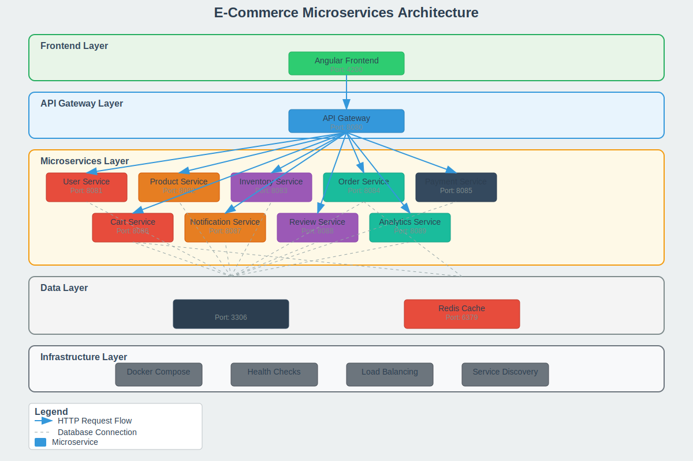

# E-Commerce Microservices Platform

A complete e-commerce platform built with microservices architecture using Angular, Spring Boot, MySQL, and Redis. This platform demonstrates modern cloud-native development practices with containerized services, health monitoring, and scalable architecture.

## Architecture Diagram



## Key Features

✅ **Microservices Architecture** - 10 independent services  
✅ **Containerized Deployment** - Docker & Docker Compose  
✅ **Health Monitoring** - Built-in health checks for all services  
✅ **API Gateway** - Centralized routing and authentication  
✅ **Caching Layer** - Redis for performance optimization  
✅ **Database Per Service** - Isolated data storage  
✅ **Production Ready** - Optimized Docker images with security

## Project Structure

```
e-commerce-microservices/
├── backend/
│   ├── api-gateway/           # API Gateway (Port: 8080)
│   ├── user-service/          # User Management (Port: 8081)
│   ├── product-service/       # Product Catalog (Port: 8082)
│   ├── inventory-service/     # Stock Management (Port: 8083)
│   ├── order-service/         # Order Processing (Port: 8084)
│   ├── payment-service/       # Payment Handling (Port: 8085)
│   ├── cart-service/          # Shopping Cart (Port: 8086)
│   ├── notification-service/  # Notifications (Port: 8087)
│   ├── review-service/        # Reviews & Ratings (Port: 8088)
│   └── analytics-service/     # Business Analytics (Port: 8089)
├── frontend/                  # Angular App (Port: 4200)
├── database/                  # Database Scripts
├── docker-compose.yml         # Container Orchestration
├── build-all.bat             # Build Script
└── README.md
```

## Architecture Overview

### 🎨 Frontend Layer
- **Angular 17** - Modern SPA with TypeScript
- **Angular Material** - Material Design components
- **RxJS** - Reactive programming patterns
- **Nginx** - Production web server

### 🚪 API Gateway Layer
- **Spring Cloud Gateway** - Request routing & load balancing
- **JWT Authentication** - Secure token-based auth
- **Rate Limiting** - API protection
- **CORS Configuration** - Cross-origin support

### ⚙️ Microservices Layer
| Service | Port | Responsibility | Database |
|---------|------|----------------|----------|
| **User Service** | 8081 | Authentication, User profiles | MySQL |
| **Product Service** | 8082 | Product catalog, Search | MySQL |
| **Inventory Service** | 8083 | Stock management, Availability | MySQL |
| **Order Service** | 8084 | Order processing, Workflow | MySQL |
| **Payment Service** | 8085 | Payment processing, Transactions | MySQL |
| **Cart Service** | 8086 | Shopping cart, Session management | Redis |
| **Notification Service** | 8087 | Email, SMS, Push notifications | MySQL |
| **Review Service** | 8088 | Product reviews, Ratings | MySQL |
| **Analytics Service** | 8089 | Business metrics, Reporting | MySQL |

### 💾 Data Layer
- **MySQL 8.0** - Primary relational database
- **Redis 7** - Caching & session storage
- **Database per Service** - Data isolation pattern

### 🐳 Infrastructure Layer
- **Docker Compose** - Multi-container orchestration
- **Health Checks** - Service monitoring
- **Alpine Linux** - Minimal container images
- **Non-root Users** - Security hardening

## Service Ports

| Service | Port | URL | Health Check | Description |
|---------|------|-----|--------------|-------------|
| 🌐 Frontend | 4200 | http://localhost:4200 | ✅ HTTP | Angular Web App |
| 🚪 API Gateway | 8080 | http://localhost:8080 | ✅ Actuator | Main Entry Point |
| 👤 User Service | 8081 | http://localhost:8081 | ✅ Actuator | Authentication & Users |
| 📦 Product Service | 8082 | http://localhost:8082 | ✅ Actuator | Product Catalog |
| 📊 Inventory Service | 8083 | http://localhost:8083 | ✅ Actuator | Stock Management |
| 🛒 Order Service | 8084 | http://localhost:8084 | ✅ Actuator | Order Processing |
| 💳 Payment Service | 8085 | http://localhost:8085 | ✅ Actuator | Payment Handling |
| 🛍️ Cart Service | 8086 | http://localhost:8086 | ✅ Actuator | Shopping Cart |
| 📧 Notification Service | 8087 | http://localhost:8087 | ✅ Actuator | Email Notifications |
| ⭐ Review Service | 8088 | http://localhost:8088 | ✅ Actuator | Product Reviews |
| 📈 Analytics Service | 8089 | http://localhost:8089 | ✅ Actuator | Business Analytics |
| 🗄️ MySQL Database | 3306 | localhost:3306 | ✅ mysqladmin | Primary Database |
| ⚡ Redis Cache | 6379 | localhost:6379 | ✅ redis-cli | Caching Layer |

## 🚀 Quick Start

### Prerequisites
- **Docker** (v20.10+)
- **Docker Compose** (v2.0+)
- **8GB RAM** minimum
- **Ports 3306, 4200, 6379, 8080-8089** available

### 🐳 Docker Deployment
```bash
# Clone the repository
git clone <repository-url>
cd e-commerce-microservices

# Start all services
docker-compose up -d --build

# Check service health
docker-compose ps

# View logs
docker-compose logs -f [service-name]

# Stop all services
docker-compose down
```

### 🔍 Service Health Monitoring
```bash
# Check all service health
for port in {8080..8089}; do
  echo "Service on port $port:"
  curl -s http://localhost:$port/actuator/health | jq '.status'
done
```


## 📚 API Documentation

### Swagger UI Endpoints
- **API Gateway:** http://localhost:8080/swagger-ui.html
- **User Service:** http://localhost:8081/swagger-ui.html
- **Product Service:** http://localhost:8082/swagger-ui.html
- **Order Service:** http://localhost:8084/swagger-ui.html
- **Payment Service:** http://localhost:8085/swagger-ui.html

### Health Check Endpoints
- **All Services:** `http://localhost:808X/actuator/health`
- **MySQL:** `docker exec mysql mysqladmin ping`
- **Redis:** `docker exec redis redis-cli ping`

### Sample API Calls
```bash
# Register user
curl -X POST http://localhost:8080/api/users/register \
  -H "Content-Type: application/json" \
  -d '{"username":"john","email":"john@example.com","password":"password123"}'

# Get products
curl http://localhost:8080/api/products

# Add to cart
curl -X POST http://localhost:8080/api/cart/add \
  -H "Authorization: Bearer <token>" \
  -H "Content-Type: application/json" \
  -d '{"productId":1,"quantity":2}'
```

## ✨ Features

### 👤 User Management
- ✅ User registration & login
- ✅ JWT-based authentication
- ✅ Profile management
- ✅ Role-based access control

### 🛍️ E-Commerce Core
- ✅ Product catalog with search & filters
- ✅ Shopping cart with session persistence
- ✅ Order processing workflow
- ✅ Payment integration ready
- ✅ Inventory tracking
- ✅ Product reviews & ratings

### 🔔 Communication
- ✅ Email notifications
- ✅ Order status updates
- ✅ Real-time alerts

### 📊 Analytics & Monitoring
- ✅ Business metrics dashboard
- ✅ Service health monitoring
- ✅ Performance analytics
- ✅ User behavior tracking

### 🛡️ Security & Performance
- ✅ API rate limiting
- ✅ Redis caching
- ✅ Database connection pooling
- ✅ Container security hardening

## 🛠️ Technology Stack

### Frontend
- **Framework:** Angular 17
- **UI Library:** Angular Material
- **Language:** TypeScript
- **Build Tool:** Angular CLI
- **Web Server:** Nginx (Production)

### Backend
- **Framework:** Spring Boot 3.2.0
- **Security:** Spring Security + JWT
- **Data Access:** Spring Data JPA
- **API Gateway:** Spring Cloud Gateway
- **Language:** Java 17
- **Build Tool:** Maven 3.9.6

### Databases
- **Primary:** MySQL 8.0
- **Cache:** Redis 7
- **Connection Pooling:** HikariCP

### DevOps & Infrastructure
- **Containerization:** Docker + Docker Compose
- **Base Images:** Eclipse Temurin (JRE), Alpine Linux
- **Monitoring:** Spring Actuator
- **Health Checks:** Built-in Docker health checks

### Development Tools
- **IDE:** IntelliJ IDEA / VS Code
- **API Testing:** Postman / Swagger UI
- **Version Control:** Git

## 🏗️ Development Setup

### Local Development
```bash
# Backend (each service)
cd backend/[service-name]
mvn spring-boot:run

# Frontend
cd frontend
npm install
npm start
```

### Environment Variables
Create `.env` file:
```env
# Database
MYSQL_ROOT_PASSWORD=rootpassword
DB_PASSWORD=password

# JWT
JWT_SECRET=your-secret-key
JWT_EXPIRATION=86400

# Ports
API_GATEWAY_PORT=8080
USER_SERVICE_PORT=8081
# ... other ports
```

## 🤝 Contributing

1. Fork the repository
2. Create feature branch (`git checkout -b feature/amazing-feature`)
3. Commit changes (`git commit -m 'Add amazing feature'`)
4. Push to branch (`git push origin feature/amazing-feature`)
5. Open Pull Request

## 📄 License

This project is licensed under the MIT License - see the [LICENSE](LICENSE) file for details.

## 🆘 Troubleshooting

### Common Issues

**Port conflicts:**
```bash
# Check port usage
netstat -tulpn | grep :8080

# Kill process on port
sudo kill -9 $(lsof -t -i:8080)
```

**Docker issues:**
```bash
# Clean Docker system
docker system prune -a

# Rebuild without cache
docker-compose build --no-cache
```

**Database connection:**
```bash
# Check MySQL logs
docker-compose logs mysql

# Connect to MySQL
docker exec -it mysql mysql -u root -p
```

## 📞 Support

For support and questions:
- Create an issue on GitHub
- Check existing documentation
- Review Docker logs for errors